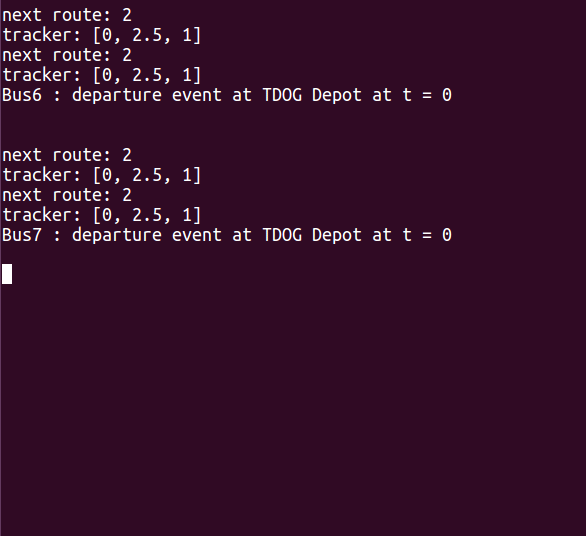
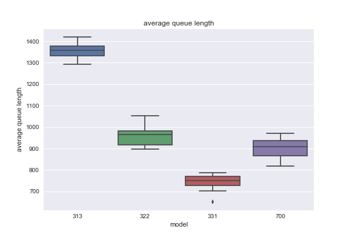

# PySimio: A Library for Discrete-Event Simulation
**PySimio** is a Python library for object-oriented discrete-event simulation. You can simulate multiple agents (vehicles, entities) in a non-deterministic system. We support muilti-core processing to speed up experiments. 


## Features
- Object-Oriented Simulation
- Animation
- Commandline Debugging
- Statistic Collection and Data Visualization 
- Multicore Processing

## Setup
PySimio is built with the following libraries:
- `numpy` (back-end numerical calculations)  
- `pandas` (reading/writing data logs)  
- `seaborn, matplotlib` (data visualization)  
- `pygame` (animation rendering)   
  
All of the above packages can be installed through the package management system pip as below:
```
pip install numpy pandas seaborn matplotlib pygame
```
- `pysmac`  (Bayesian optimization) 
```
pip install git+https://github.com/sfalkner/pysmac.git --user
```

We highly recommend using **Python 3.6.1** or greater.
We also discovered the issue that pygame fails to render properly with Mac retina display ([link](https://stackoverflow.com/questions/29834292/pygame-simple-loop-runs-very-slowly-on-mac)).


## Sample Usage
We model several bus routes around Ithaca, NY to help the Tompkins Department of Going-Places (TDOG) save Cornell students from the perilous weather of upstate New York.  


### Model
```Python
# create BusStop objects  
depot = BusStop('TDOG Depot')  
weg_east = BusStop('Wegmans-Eastbound')  
weg_west = BusStop('Wegmans-Westbound')  
com_east = BusStop('Commons-Eastbound')  
com_west = BusStop('Commons-Westbound')  
ctown = BusStop('Collegetown')  
  
# route distance data  
r1d = [0.5, 2, 2, 2, 2, 0.5]  
r2d = [2, 2, 0.3]  
r3d = [0.5, 2, 0.3, 2, 0.5]    

# route switch point data - see Documentation for details
r1s = {2: {depot:[2.5,1], weg_east:[2,1], com_east:[0,1], ctown:[0,2], com_west:[5,1], weg_west:[3,1]},
       3: {depot:[0,1], weg_east:[0,2], com_east:[4,4], ctown:[2,4], com_west:[0,4], weg_west:[0,0]}}
r2s = {1: {com_east:[0,3], ctown:[0,4], com_west:[0,5]},
       3: {com_east:[0,3], ctown:[2,4], com_west:[0,4]}}
r3s = {1: {depot:[0,1], weg_east:[0,2], com_east:[0,3], com_west:[0,5], weg_west:[0,0]},
       2: {depot:[2.5,1], weg_east:[2,1], com_east:[0,1], com_west:[5,1], weg_west:[3,1]}}
   
# create a Route object for each of the 3 routes   
route1 = Route([depot, weg_east, com_east, ctown, com_west, weg_west, depot], r1d, r1s, number=1)   
route2 = Route([com_east, ctown, com_west, com_east], r2d, r2s, number=2)   
route3 = Route([depot, weg_east, com_east, com_west, weg_west, depot], r3d, r3s, number=3) 

# specify schedule for each bus
b1 = [1, 1, 1, 1, 1, 1]
b2 = [1, 2, 2, 2, 3, 1]
b3 = [3, 1, 1, 1, 1, 1]
b4 = [1, 3, 2, 3, 2, 2]
b5 = [2, 2, 1, 2, 1, 1]
b6 = [1, 1, 1, 2, 3, 1]
b7 = [1, 2, 2, 2, 3, 3]

from experiment import create_map
ithaca = create_map([b1, b2, b3, b4, b5, b6, b7], arrival_data='data/ArrivalRates.xlsx', name='map1')
ithaca.simulate(60*18, animate=True, debug=False)
```
### Debugging
PySimio supports command-line debugging by printing each discrete event, processing one event at a time when prompted by the user. 



### Experiments
Comparison of different models can be easily done with PySimio. The `experiment` function returns a DataFrame of the results of each model configuration. 
```Python
SIMULATION_LENGTH = 60*18
ITERATIONS = 20

route1 = [1, 1, 1, 1, 1, 1]
route2 = [2, 2, 2, 2, 2, 2]
route3 = [3, 3, 3, 3, 3, 3]

model1 = create_map(routes_per_bus=[route1, route1, route1, route1, route1, route1, route1], name='700')
model2 = create_map(routes_per_bus=[route1, route1, route1, route1, route1, route2, route3], name='511')
model3 = create_map(routes_per_bus=[route1, route1, route1, route2, route2, route3, route3], name='322')

experiment([model1, model2, model3], SIMULATION_LENGTH, ITERATIONS)
```
Our experiments make the best use of multiprocessing library for more efficient computation

### Visualization
PySimio records the simulation results in csv format, which makes the data analysis very easy. This library contains three functions to automatically output time-series and boxplot of utilities. 
```Python
# store experiment results in csv format 
import pandas as pd
from analysis import draw_time_series, draw_smore, draw_time_series_bus
# output csv file
experiment([model1, model2, model3], SIMULATION_LENGTH, ITERATIONS, output_report=True, output='results.csv')
df = pd.read_csv('results.csv')  # load file

draw_time_series(df)             # time-series for utility of servers 
draw_time_series_bus(df)         # time-series for utility of vehicles 
draw_smore(df)                   # box-plot for utility
```
The function uses the seaborn package and outputs the following visualizations:  

  

## Documentation

### Dynamic Route Switching
In order to allow for dynamic route switching (i.e. at any time and at any point), you provide a nested dictionary. The first key specifies which route to switch to, the second key specifies which stop you are currently at, and the value is a list: the first element specifies the distance until the stop where the route switch will be executed; the second element specifies the index of the next stop on the new route, once the route switch has been executed.  
  
For example, 
```Python
r1s = {2: {depot: [2.5, 1]}}
```
indicates when switching from route 1 to route 2 for a bus currently at the depot, the bus must wait until it has travelled 2.5km (i.e. it reaches Commons-Eastbound) before executing the route change, and once the route change has been executed the next stop is indexed by #1 in the new route (i.e. Collegetown).

### Optimization
As these models contain complex interactions that make it difficult to compute summary statistics in a closed-form solution, PySimio conducts optimization through Bayesian optimization. Although Bayesian optimization supports the optimization of any black-box function, assumptions about the distribution of functions considered make it more suitable for functions that are less sensitive to small changes in their input, as illustrated below:   

  

To conduct optimization, define a function from the space of variables you have control over (e.g. schedules for each bus) to a target variable that you want to optimize (e.g. average waiting time).
```Python
def avg_waiting_time(x21, x22, x23, x24, x25, x26):
    # this is pseudocode
    create_map(x21, x22, x23, x24, x25, x26)                
    return stats['average waiting time'].values.mean()
```
You will then need to provide a dictionary specifying the type of each variable (real/integer/categorical/ordinal), a starting point, and total number of iterations. Our implementation will save the dictionary of optimal parameters found as a .pkl file.
```Python
parameters = dict(
    x21=('categorical', [1, 2, 3], 2), x22=('categorical', [1, 2, 3], 2), x23=('categorical', [1, 2, 3], 1),
    x24=('categorical', [1, 2, 3], 1), x25=('categorical', [1, 2, 3], 3), x26=('categorical', [1, 2, 3], 1),
)
opt = pysmac.SMAC_optimizer()
value, parameters = opt.minimize(avg_waiting_time, 1000, parameters)    # 1000 iterations
save_obj(parameters, 'lowest_waiting_time')
```
