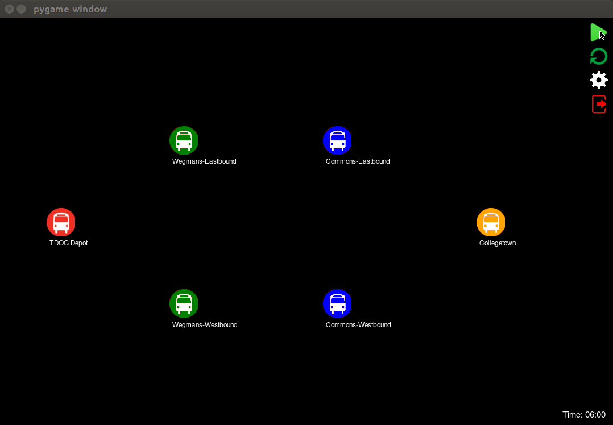
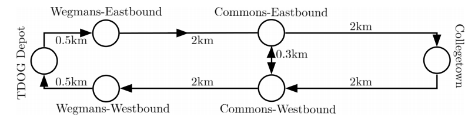

# PySimio: A Library for Discrete-Event Simulation
**PySimio** is a Python library for object-oriented discrete-event simulation. You can simulate multiple agents (vehicles, entities) in a non-deterministic system. We support muilti-core processing to speed up experiments. 



GIF for command debug

## Features
- Object-Oriented Simulation
- Animation
- Commandline Debugging
- Statistic Collection and Data Visualization 
- Multicore Processing

## Setup
PySimio is built with the following libraries:
- `numpy` (back-end numerical calculations)  
- `pandas` (reading/writing data logs)  
- `seaborn, matplotlib` (data visualization)  
- `pygame` (animation rendering)   
  
All of the above packages can be installed through the package management system pip as below:
```
pip install numpy pandas seaborn matplotlib pygame
```
- `pysmac`  (Bayesian optimization) 
```
pip install git+https://github.com/sfalkner/pysmac.git --user
```

We highly recommend using **Python 3.6.1** or greater.
We also discovered the issue that pygame fails to render properly with Mac retina display ([link](https://stackoverflow.com/questions/29834292/pygame-simple-loop-runs-very-slowly-on-mac)).


## Sample Usage
We model several bus routes around Ithaca, NY to help the Tompkins Department of Going-Places (TDOG) save Cornell students from the perilous weather of upstate New York.  
  

```
# create BusStop objects  
depot = BusStop('TDOG Depot')  
weg_east = BusStop('Wegmans-Eastbound')  
weg_west = BusStop('Wegmans-Westbound')  
com_east = BusStop('Commons-Eastbound')  
com_west = BusStop('Commons-Westbound')  
ctown = BusStop('Collegetown')  
  
# route distance data  
r1d = [0.5, 2, 2, 2, 2, 0.5]  
r2d = [2, 2, 0.3]  
r3d = [0.5, 2, 0.3, 2, 0.5]    
   
# create a Route object for each of the 3 routes   
route1 = Route([depot, weg_east, com_east, ctown, com_west, weg_west, depot], r1d, r1s, number=1)   
route2 = Route([com_east, ctown, com_west, com_east], r2d, r2s, number=2)   
route3 = Route([depot, weg_east, com_east, com_west, weg_west, depot], r3d, r3s, number=3)   
```

## Documentation

